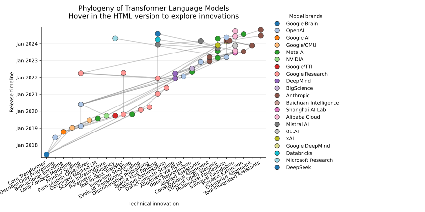

# LLM Phylogeny

LLM Phylogeny maps how milestone large language models build on one another's
architectural innovations. The interactive network links each release to the
ideas it inherits so you can trace the technical lineage that shaped today's
transformer ecosystem.



## Explore the interactive network

GitHub strips the JavaScript that powers a Bokeh figure from Markdown pages, so
the chart cannot be embedded directly in this README. Instead, use one of the
following options to open the same interactive HTML artifact that lives in
[`docs/interactive_llm_phylogeny.html`](docs/interactive_llm_phylogeny.html):

1. **Open the viewer through HTMLPreview** (quickest way from GitHub):
   1. Click the **Open interactive viewer** badge below to open the HTML file.
   2. In the toolbar of the new page, choose **View raw**.
   3. Copy the browser URL and paste it into [htmlpreview.github.io](https://htmlpreview.github.io/).
   4. The hosted preview will load the interactive Bokeh app in your browser.
      You can also build the link yourself by replacing `<your-user>` in
      [`https://htmlpreview.github.io/?https://raw.githubusercontent.com/<your-user>/LLM_phylogeny/main/docs/interactive_llm_phylogeny.html`](https://htmlpreview.github.io/?https://raw.githubusercontent.com/<your-user>/LLM_phylogeny/main/docs/interactive_llm_phylogeny.html).

   [](docs/interactive_llm_phylogeny.html)

2. **Launch it locally** if you have the repository cloned:
   ```bash
   python -m http.server --directory docs
   ```
   Then visit [http://localhost:8000/interactive_llm_phylogeny.html](http://localhost:8000/interactive_llm_phylogeny.html) in your browser.

3. **Regenerate the HTML** (optional) after editing the dataset:
   ```bash
   python app/llm_phylogeny.py
   ```
   The script rebuilds both
   `docs/interactive_llm_phylogeny.html`
   and `docs/interactive_llm_phylogeny.svg` from `data/llm_models.csv`.
   Use `--no-svg` if you want to skip regenerating the static figure.

## Dataset

All model metadata is stored in [`data/llm_models.csv`](data/llm_models.csv) so
the graph can be regenerated or extended with new models. Each row contains:

| column | description |
| --- | --- |
| `name` | Model name shown in the network. |
| `family` | High-level model family used for colour coding. |
| `release_month` | Month and year of the public release in `DD-MM-YYYY` format. |
| `innovation` | Key architectural idea associated with the release. |
| `influences` | Semicolon-separated list of upstream models. |

Keep the CSV sorted chronologically by `release_month` so that the generated
timeline flows naturally from left to right.

## Development workflow

1. Update `data/llm_models.csv` with any new models.
2. Run `python app/llm_phylogeny.py` to rebuild the HTML output.
3. Commit both the CSV changes and the regenerated
   `docs/interactive_llm_phylogeny.html` so the hosted preview stays current.

## Project goals

The visualisation is designed to make the evolution of large language models
clear at a glance:

- Highlight when novel architectural ideas (Mixture-of-Experts, RLHF, long-context
  attention, etc.) enter the ecosystem.
- Show how families build on previous work through explicit influence edges.
- Convey the rapid cadence of releases over time through the horizontal timeline.

Contributions are welcome—feel free to open issues or PRs that add new models,
refine the taxonomy, or improve the interactivity of the plot.
