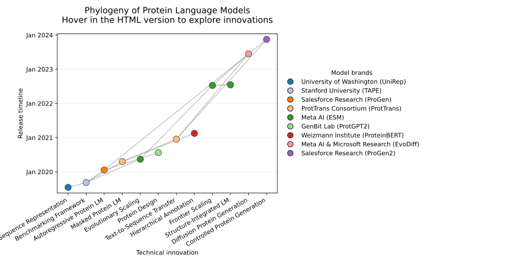
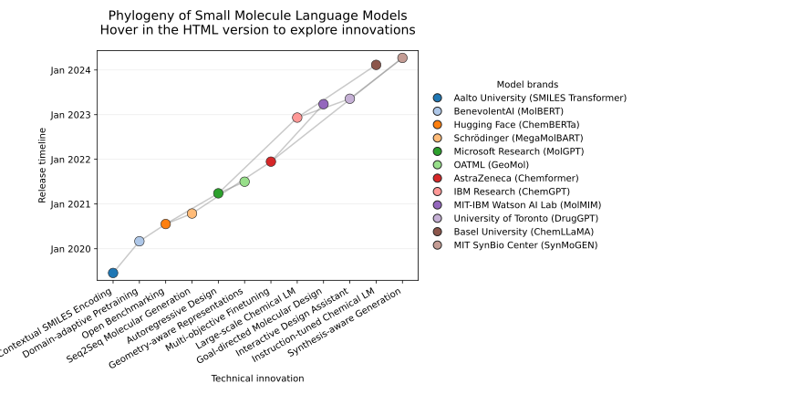

Please note: This is produced via LLM prompting only (via chat interphase of Codex), so take care not to trust the figures at face value. 

# LLM Phylogeny

LLM Phylogeny maps how milestone large language models build on one another's
architectural innovations. The interactive network links each release to the
ideas it inherits so you can trace the technical lineage that shaped today's
transformer ecosystem. Models appear at the intersection of their
breakthrough innovation (x-axis) and release timing (y-axis), while colours
group models by brand for quick visual scanning.


## Explore the interactive network

GitHub strips the JavaScript that powers a Bokeh figure from Markdown pages, so
the chart cannot be embedded directly in this README. Instead, use one of the
following options to open the same interactive HTML artifact that lives in
[`docs/interactive_llm_phylogeny.html`](docs/interactive_llm_phylogeny.html):

1. **Open the viewer through HTMLPreview** (quickest way from GitHub):
   1. Click the **Open interactive viewer** badge below to open the HTML file.
   2. In the toolbar of the new page, choose **View raw**.
   3. Copy the browser URL and paste it into [htmlpreview.github.io](https://htmlpreview.github.io/).
   4. The hosted preview will load the interactive Bokeh app in your browser.
      You can also build the link yourself by replacing `<your-user>` in
      [`https://htmlpreview.github.io/?https://raw.githubusercontent.com/<your-user>/LLM_phylogeny/main/docs/interactive_llm_phylogeny.html`](https://htmlpreview.github.io/?https://raw.githubusercontent.com/<your-user>/LLM_phylogeny/main/docs/interactive_llm_phylogeny.html).

   [](docs/interactive_llm_phylogeny.html)

2. **Launch it locally** if you have the repository cloned:
   ```bash
   python -m http.server --directory docs
   ```
   Then visit [http://localhost:8000/interactive_llm_phylogeny.html](http://localhost:8000/interactive_llm_phylogeny.html) in your browser.

3. **Regenerate the HTML** (optional) after editing any dataset:
   ```bash
   python app/llm_phylogeny.py \
       --data data/llm_models.csv \
       --output docs/interactive_llm_phylogeny.html \
       --svg-output docs/interactive_llm_phylogeny.svg
   ```
   Use the `--data` flag to point at any CSV under `data/` and `--title` if you
   want the figure header to reflect the dataset you are plotting. Pass
   `--no-svg` to skip regenerating the static figure when only the interactive
   output is needed.

## Dataset

All model metadata is stored in the CSV files under [`data/`](data) so any of
the graphs can be regenerated or extended with new models. Every dataset shares
the same schema, which keeps the tooling interchangeable. Each row contains:

| column | description |
| --- | --- |
| `name` | Model name shown in the network. |
| `brand` | Organisation or company responsible for the release. |
| `family` | High-level model family used for additional grouping. |
| `release_date` | Public release date in ISO `YYYY-MM-DD` format. |
| `influences` | Semicolon-separated list of upstream models. |
| `innovation_category` | Technical innovation category plotted along the x-axis. |
| `innovation_summary` | Short description of what made the release notable. |

Keep the CSV sorted chronologically by `release_date` so that the generated
timeline flows naturally from oldest (bottom) to newest (top). The repository
currently ships with four curated datasets:

- [`data/llm_models.csv`](data/llm_models.csv) – general-purpose transformer
  language models spanning OpenAI, Anthropic, Google, Meta, and more.
- [`data/protein_models.csv`](data/protein_models.csv) – protein language
  models that capture evolutionary signals for design and structure prediction.
- [`data/genome_models.csv`](data/genome_models.csv) – nucleotide-focused
  models aimed at genomics, variant prioritisation, and long-range regulation.
- [`data/small_molecule_models.csv`](data/small_molecule_models.csv) – chemical
  foundation models for molecular property prediction and synthesis planning.

Every CSV can be plugged directly into `app/llm_phylogeny.py`, making it easy
to compare innovation trajectories across biological and general language
models without changing the code.

## Biological language model phylogenies

In addition to the transformer family tree for mainstream LLMs, the project now
charts three specialised domains of biological language models. Each static
snapshot below links to an interactive HTML file in `docs/` that you can open
following the same instructions as the primary chart.

### Proteins



Protein language models progress from the recurrent UniRep encoder through
benchmark-driven transformers such as TAPE, towards large-scale masked models
including ProtBERT and ESM-2. Recent work fuses sequence modelling with
structure-aware generation, culminating in tools like ESMFold and EvoDiff for
designing novel proteins.

### Genomes


Genome-focused language models extend tokenisation and attention mechanisms to
cope with extremely long DNA contexts. Innovations such as DNABERT's k-mer
tokenisation, Enformer's dilated attention, and HyenaDNA's implicit convolutions
enable regulatory inference and surveillance models like GenSLMs and EvoGene.

### Small molecules



Chemical language models start from SMILES Transformers for contextual
representations and evolve through masked and denoising architectures like
ChemBERTa and MegaMolBART. Subsequent models emphasise controllable generation
and synthesis feedback, with ChemGPT, DrugGPT, and SynMoGEN integrating
interactive design and retrosynthetic constraints.

## Development workflow

1. Update `data/llm_models.csv` with any new models.
2. Run `python app/llm_phylogeny.py` to rebuild the HTML output.
3. Commit both the CSV changes and the regenerated
   `docs/interactive_llm_phylogeny.html` so the hosted preview stays current.

## Project goals

The visualisation is designed to make the evolution of large language models
clear at a glance:

- Highlight when novel architectural ideas (Mixture-of-Experts, RLHF, long-context
  attention, etc.) enter the ecosystem.
- Show how families build on previous work through explicit influence edges.
- Convey the rapid cadence of releases over time through the vertical timeline.

Contributions are welcome—feel free to open issues or PRs that add new models,
refine the taxonomy, or improve the interactivity of the plot.
